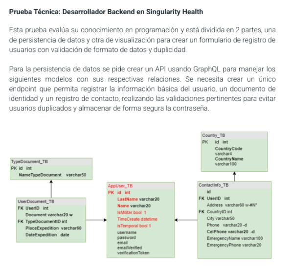

---

# Singularity Health - Prueba Técnica Backend

Este proyecto es parte de una prueba técnica para la posición de **Desarrollador Backend** en **Singularity Health**. El objetivo es construir una API usando **GraphQL** y **Sequelize** para registrar usuarios con validación de datos, manejo de relaciones entre tablas y prevención de duplicados, todo persistido en una base de datos **MySQL**.

A continuación, se muestra el diagrama entidad-relación que representa los modelos requeridos para esta prueba técnica. Este servirá como base para estructurar la base de datos y definir las asociaciones en Sequelize.



---

## 🧠 Descripción General

Se construyó una API que permite registrar usuarios mediante un solo endpoint GraphQL. Este proceso incluye:

- Datos personales del usuario
- Información de su documento de identidad
- Datos de contacto
- Validaciones para formato de datos y prevención de duplicados
- Hash seguro de contraseñas
- Envío real de correo de verificación con enlace único

Al completar el registro, el usuario recibe un correo electrónico con un enlace de verificación. Al hacer clic en este enlace, es redirigido a una vista donde se confirma que el correo ha sido verificado correctamente.

Además, se desarrolló un **frontend en React** con Material UI y Apollo Client, estructurado en componentes divididos en tres formularios:

1. `PersonalDataForm.jsx`
2. `DocumentForm.jsx`
3. `ContactForm.jsx`

Toda la lógica de registro se coordina desde el archivo `CreateUser.jsx`, ubicado en la carpeta `src/formUser/`.

## 📁 Estructura del Proyecto

El repositorio contiene dos carpetas principales:

- `node`: Proyecto Backend con Node.js, Express y GraphQL.
- `vite-project`: Proyecto Frontend con React, Vite y Apollo Client.

---

## 🚀 Tecnologías Utilizadas

### 🧩 Backend (Node.js + Express)

- **Node.js**: Entorno de ejecución para JavaScript en el servidor.  
- **Express**: Framework web minimalista para construir la API.  
- **GraphQL**: Lenguaje de consultas para la API.  
- **Apollo Server Express**: Integración de Apollo con Express para servir GraphQL.  
- **Sequelize**: ORM para modelar y gestionar la base de datos MySQL.  
- **MySQL2**: Driver de conexión para Sequelize.  
- **bcryptjs**: Para hashear contraseñas de forma segura.  
- **dotenv**: Manejo de variables de entorno.  
- **jsonwebtoken**: Para generación y validación de tokens JWT (preparado para futuras mejoras).  
- **Nodemailer**: Envío de correos para verificación de cuenta.

### 💻 Frontend (React + Vite)

- **React**: Biblioteca para construir interfaces de usuario.  
- **Vite**: Herramienta de desarrollo rápida y ligera para proyectos React.  
- **Apollo Client**: Cliente GraphQL para consumir la API desde el frontend.  
- **Material UI (MUI)**: Librería de componentes UI modernos.  
- **SweetAlert2**: Para mostrar notificaciones visuales de éxito o error durante el registro y la verificación de correo.  
- **React Router DOM**: Para manejar rutas en la SPA.

---


## ⚙️ Instalación

### 🔧 Backend

1. Abre una terminal y navega a la carpeta del backend:

```bash
cd node
```

2. Instala las dependencias:

```bash
npm install
```

3. Crea un archivo `.env` con la siguiente estructura:

```env
# Base de datos
DB_NAME=prueba_tecnica_db
DB_HOST=localhost
DB_USER=root
DB_PASS=

# JWT
JWT_SECRET=secreto123

# Gmail para Nodemailer
EMAIL_USER=example@gmail.com
EMAIL_PASS=qpmjeyuvulrvwcpm
```

4. Inicia el servidor:

```bash
node index.js
```

Esto creará la base de datos, las tablas y llenará los datos iniciales de `documents` y `country` automáticamente.

5. Abre GraphQL Playground en:

```
http://localhost:3000/graphql
```

Este será el único endpoint para realizar todas las queries y mutations.

### 📦 Frontend

1. En otra terminal, navega a la carpeta del frontend:

```bash
cd vite-project
```

2. Instala las dependencias:

```bash
npm install
```

3. Ejecuta el proyecto:

```bash
npm run dev
```

4. Abre el navegador en:

```
http://localhost:5173/
```

---

## 🧪 Ejemplo de Mutación GraphQL

### Request

```json
{
  "query": "mutation RegisterUser($input: RegisterUserInput!) { registerUser(input: $input) { id name email username emailVerified } }",
  "variables": {
    "input": {
      "lastName": "Martínez",
      "name": "Laura",
      "isMiliar": false,
      "isTemporal": false,
      "username": "lauramartinez",
      "password": "Segura123!",
      "email": "laura@example.com",
      "document": "1098476254",
      "placeExpedition": "Bogotá",
      "dateExpedition": "2020-03-15",
      "typeDocumentId": 1,
      "address": "Calle 123 #45-67",
      "countryId": 1,
      "city": "Bogotá",
      "phone": "1234567",
      "celPhone": "3001234567",
      "emergencyName": "Carlos Martínez",
      "emergencyPhone": "3107654321"
    }
  }
}
```

### Respuesta

```json
{
  "data": {
    "registerUser": {
      "id": "1",
      "name": "Laura",
      "email": "laura@example.com",
      "username": "lauramartinez",
      "emailVerified": false
    }
  }
}
```

---

## 🔐 Seguridad

- Las contraseñas se almacenan de forma segura utilizando **bcrypt**, aplicando hashing antes de guardarlas en la base de datos.
- Se implementan validaciones para evitar registros duplicados basados en **correo electrónico**, **nombre de usuario** y **número de documento**.
- La verificación de correo electrónico es **real**, enviando un enlace único al email del usuario. Al hacer clic, se confirma la veracidad del correo.
- Se muestran notificaciones claras al usuario mediante **SweetAlert2**, mejorando la experiencia durante el proceso de registro y verificación.


---

### 🔐 Verificación de Correo Electrónico

Durante el proceso de registro, el sistema genera un **token de verificación único** y lo envía al correo del usuario mediante **Nodemailer**. Este enlace permite confirmar el correo electrónico del usuario a través de una vista del frontend.

- El enlace tiene el siguiente formato:  
  `http://localhost:5173/verificationEmail?token=...`
- Al hacer clic, el usuario es redirigido a una vista (`/verificationEmail`) donde se muestra un mensaje de confirmación usando **SweetAlert2**.
- Si el token es válido, el campo `emailVerified` del usuario se actualiza a `true` en la base de datos.
- El token es seguro, firmado y de un solo uso.

#### ⚙️ Funcionamiento Técnico

**Backend:**
- Al crear un nuevo usuario, se genera un token JWT con el ID del usuario.
- Se envía un correo al usuario con el enlace que contiene ese token como parámetro.
- Cuando el usuario accede al enlace, el backend recibe la solicitud y verifica el token.
- Si el token es válido, actualiza el estado del usuario (`emailVerified = true`).

**Frontend:**
- Al visitar el enlace, se renderiza una vista específica (`/verificationEmail`) que muestra una notificación visual al usuario indicando si su correo fue verificado exitosamente.

#### 📧 Configuración para envío de correos

Para habilitar esta funcionalidad, es necesario configurar las siguientes variables en el archivo `.env` del backend:

```env
# Gmail para Nodemailer
EMAIL_USER=example@gmail.com
EMAIL_PASS=qpmjeyuvulrvwcpm
``` 

- `EMAIL_USER`: Correo electrónico desde el cual se enviarán los mensajes (debe ser una cuenta válida de Gmail).
- `EMAIL_PASS`: Contraseña de aplicación generada desde [Google Apps](https://myaccount.google.com/apppasswords), necesaria para permitir el acceso a Nodemailer.

> ⚠️ **Importante**: Esta contraseña **no es la contraseña del correo**, sino una **clave especial generada para aplicaciones**.  
> Asegúrate de mantener estas credenciales fuera del control de versiones (inclúyelas en `.gitignore`) y usar un gestor de secretos adecuado en producción.


---

## 🛠️ Mejoras Pendientes

- [ ] Incluir **pruebas unitarias** (por ejemplo con Jest) para garantizar la calidad del código.
- [ ] Implementar un sistema de **autenticación con JWT** para permitir login seguro y sesiones protegidas.
- [ ] **Dockerizar** el proyecto para facilitar su despliegue, replicabilidad y manejo de entornos.


---

## 👨‍💻 Autor

Desarrollado por **Johan Esteban Cañola Olarte**  
📧 dev.johanEstebanCO@gmail.com

Este proyecto es parte de una evaluación técnica para **Singularity Health**.
